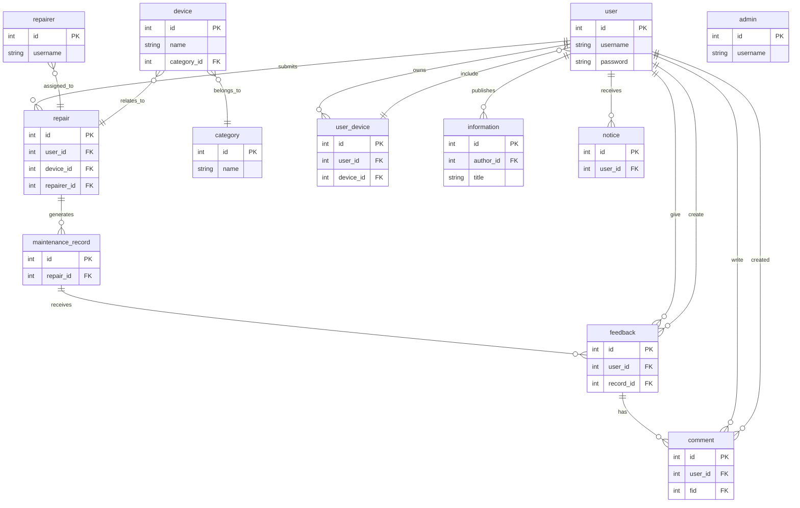

```mermaid
erDiagram
    user {
        int id PK
        string username
        string password
    }
    repair {
        int id PK
        int user_id FK
        int device_id FK
        int repairer_id FK
    }
    device {
        int id PK
        string name
        int category_id FK
    }
    category {
        int id PK
        string name
    }
    repairer {
        int id PK
        string username
    }
    maintenance_record {
        int id PK
        int repair_id FK
    }
    feedback {
        int id PK
        int user_id FK
        int record_id FK
    }
    comment {
        int id PK
        int user_id FK
        int fid FK
    }
    user_device {
        int id PK
        int user_id FK
        int device_id FK
    }
    information {
        int id PK
        int author_id FK
        string title
    }
    notice {
        int id PK
        int user_id FK
    }
    admin {
        int id PK
        string username
    }

    user ||--o{ repair : submits
    user ||--o{ user_device : owns
    user ||--o{ information : publishes
    user ||--o{ notice : receives
    device }o--|| category : belongs_to
    repairer }o--|| repair : assigned_to
    device }o--|| repair : relates_to
    repair ||--o{ maintenance_record : generates
    maintenance_record ||--o{ feedback : receives
    feedback ||--o{ comment : has
    user ||--o{ comment : write
    user ||--o{ feedback : give
    user }o--|| user_device : include
    user ||--o{ comment : created
    user ||--o{ feedback : create
```